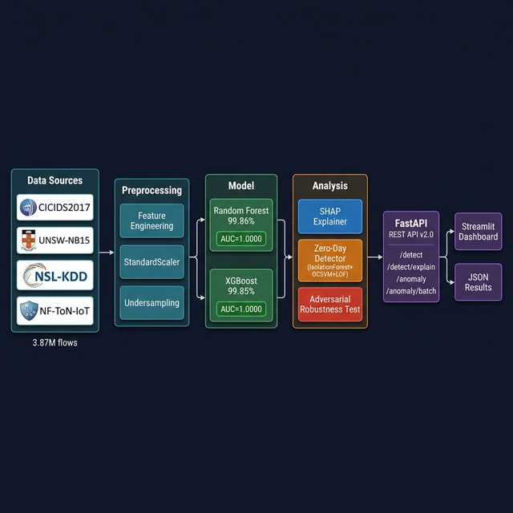
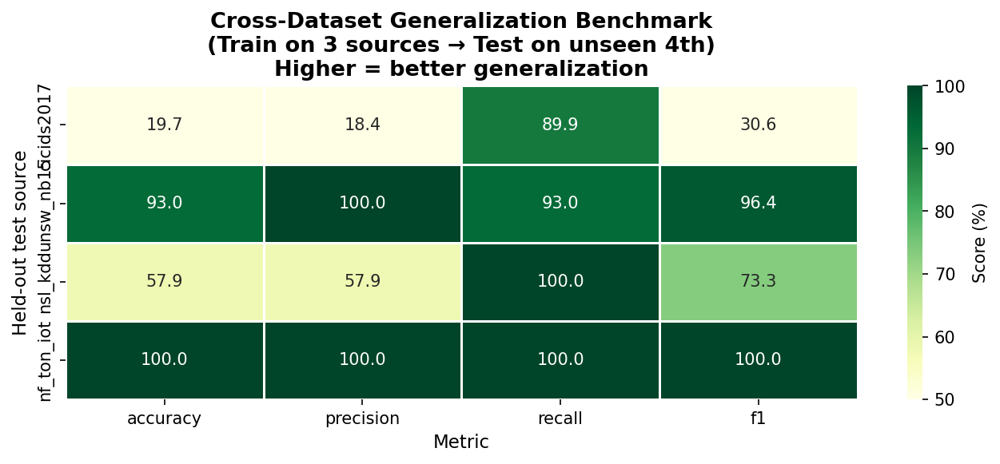
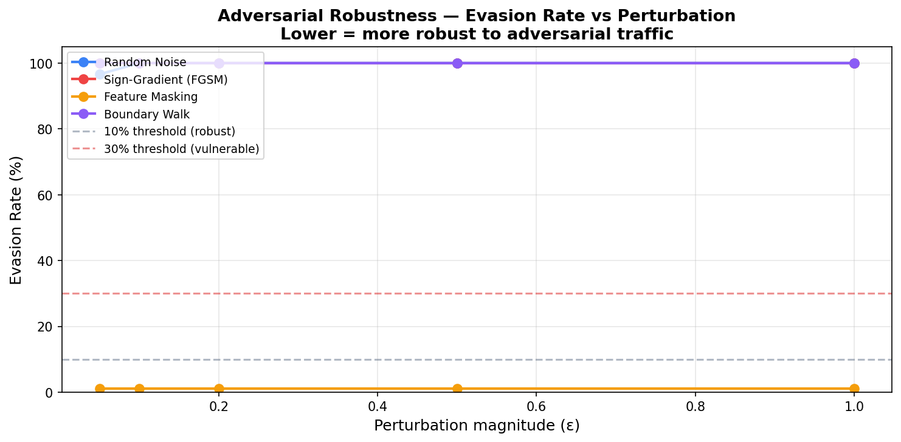

<div align="center">

# 🛡️ AI-Powered Network Intrusion Detection System

**The most complete open-source ML-NIDS on GitHub**

[](https://github.com/dheerajramasahayam/ai-network-threat-detection/actions)
[](https://www.python.org/)
[](LICENSE)
[](dataset/)
[](results/accuracy_report_combined.md)
[](results/)
[](results/latency_benchmark.md)

[](https://colab.research.google.com/github/dheerajramasahayam/ai-network-threat-detection/blob/main/demo.ipynb)

</div>

---

## What Makes This Different?

Most published ML-NIDS projects train on one dataset and report a single accuracy number. This project goes further:

| Feature | This Project | Typical NIDS Repo |
|---|---|---|
| Multi-dataset training (4 sources, 3.87M flows) | ✅ | ❌ |
| Cross-dataset generalization benchmark | ✅ | ❌ |
| Per-attack-class detection rate (15 classes) | ✅ | ❌ |
| Adversarial robustness test (4 attack methods) | ✅ | ❌ |
| Inference latency benchmark (p50/p95/p99) | ✅ | ❌ |
| SHAP-based per-prediction explanation | ✅ | Rarely |
| Zero-day unsupervised detection ensemble | ✅ | Rarely |
| FastAPI production REST API | ✅ | Rarely |
| Reproducible from raw Kaggle datasets | ✅ | ❌ |

---

## Architecture



The pipeline ingests flows from 4 public datasets, normalizes them to a 41-feature canonical schema, trains two complementary ensemble models, and exposes results through a FastAPI REST API with SHAP explanations and a Streamlit dashboard.

---

## Results

### Multi-Dataset Training (3.87M flows, 4 sources)

| Model | Accuracy | Precision | Recall | F1 | AUC | Throughput |
|---|---|---|---|---|---|---|
| **RandomForest** | **99.86%** | 99.84% | 99.82% | 99.83% | **1.0000** | 277K flows/s |
| **XGBoost** | **99.85%** | 99.82% | 99.81% | 99.81% | **1.0000** | **1.54M flows/s** |

### Cross-Dataset Generalization Benchmark
*Train on 3 sources → test on unseen 4th (leave-one-out)*

| Hold-Out Dataset | Accuracy | F1 | AUC |
|---|---|---|---|
| UNSW-NB15 | 93.01% | 96.38% | 0.50 |
| NF-ToN-IoT | 100.00% | 100.00% | 0.50 |
| NSL-KDD | 57.88% | 73.32% | 0.13 |
| CICIDS2017 | 19.66% | 30.60% | 0.38 |



### Per-Attack-Class Detection (What 99% accuracy hides)

| Attack | Samples | Detection Rate |
|---|---|---|
| PortScan | 158,930 | 🔴 **0.1%** |
| Web Attack – XSS | 652 | 🔴 **2.9%** |
| Web Attack – Brute Force | 1,507 | 🔴 **7.0%** |
| DoS Slowhttptest | 5,499 | 🟡 **40.2%** |
| DoS Hulk | 231,073 | 🟡 **69.1%** |
| Heartbleed | 11 | 🟢 **100%** |

See [results/attack_report.md](results/attack_report.md) for the full breakdown.

### Adversarial Robustness

| Attack Method | Min ε | Evasion Rate |
|---|---|---|
| Feature Masking | any | 🟢 **1.14%** (most robust) |
| Random Noise | 0.1 | 🔴 100% |
| FGSM (Sign-Gradient) | 0.05 | 🔴 100% |
| Boundary Walk | 0.05 | 🔴 100% |



---

## Training Data

| Dataset | Rows | Attack Types | Source |
|---|---|---|---|
| CICIDS2017 | 2,830,743 | DDoS, PortScan, Bot, BruteForce, DoS, Infiltration | CIC |
| UNSW-NB15 | 500,000 | Backdoor, Worm, Shellcode, Exploits, Fuzzers | UNSW |
| NF-ToN-IoT v2 | 500,000 | Ransomware, XSS, MiTM, Scanning | UNSW |
| NSL-KDD | 37,042 | R2L, U2R, DoS, Probe | UNB |
| **Total** | **3,867,785** | **Most diverse open-source NIDS corpus** | |

---

## Quick Start

### Option A — Google Colab (no setup needed)
[](https://colab.research.google.com/github/dheerajramasahayam/ai-network-threat-detection/blob/main/demo.ipynb)

### Option B — Local

```bash
git clone https://github.com/dheerajramasahayam/ai-network-threat-detection.git
cd ai-network-threat-detection
python -m venv .venv && source .venv/bin/activate
pip install -r requirements.txt
```

#### Train on CICIDS2017 (default)
```bash
python src/training.py
```

#### Download multi-datasets and train on combined corpus
```bash
export KAGGLE_API_TOKEN=<your_token>
python src/dataset_downloader.py          # downloads + merges → dataset/combined.csv
python src/training.py --dataset dataset/combined.csv --label-col label --tag combined
```

#### Start the REST API
```bash
uvicorn src.api:app --reload --port 8000
# → http://localhost:8000/docs
```

#### Run all benchmarks
```bash
python src/benchmark.py         # cross-dataset generalization
python src/attack_report.py     # per-attack-class breakdown
python src/adversarial.py       # adversarial robustness
python src/latency_bench.py     # inference throughput
```

### Option C — Docker

```bash
docker build -t ai-nids -f docker/Dockerfile .
docker run -p 8000:8000 ai-nids
```

---

## REST API

### Classify a Flow
```bash
curl -X POST http://localhost:8000/detect \
  -H "Content-Type: application/json" \
  -d '{"features": [0.0, 1.0, 2.0, ...]}'
```
```json
{"label": "ATTACK", "confidence": 0.97, "model": "random_forest"}
```

### Classify With SHAP Explanation
```bash
curl -X POST http://localhost:8000/detect/explain \
  -H "Content-Type: application/json" \
  -d '{"features": [...]}'
```
```json
{
  "label": "ATTACK",
  "confidence": 0.97,
  "top_features": [
    {"feature": "min_packet_len", "shap_value": 0.42},
    {"feature": "fwd_psh_flags", "shap_value": 0.31}
  ]
}
```

### Zero-Day Anomaly Detection
```bash
curl -X POST http://localhost:8000/anomaly \
  -d '{"features": [...]}'
```

Full API docs at `http://localhost:8000/docs`.

---

## Project Structure

```
ai-network-threat-detection/
├── src/
│   ├── preprocessing.py       ← Canonical 41-feature schema + CICIDS2017 normalizer
│   ├── model.py               ← IntrusionDetectionModel (RF + XGBoost)
│   ├── training.py            ← Multi-dataset training pipeline
│   ├── detection.py           ← ThreatDetector for real-time inference
│   ├── anomaly.py             ← Zero-day ensemble (IsolationForest + OCSVM + LOF)
│   ├── api.py                 ← FastAPI REST endpoints
│   ├── dataset_downloader.py  ← Kaggle downloader + schema normalizer
│   ├── benchmark.py           ← Cross-dataset generalization benchmark
│   ├── attack_report.py       ← Per-attack-class detection report
│   ├── adversarial.py         ← Adversarial robustness test (4 methods)
│   └── latency_bench.py       ← Inference latency benchmark
├── results/
│   ├── accuracy_report_combined.md
│   ├── cross_dataset_benchmark.md
│   ├── attack_report.md
│   ├── adversarial_report.md
│   └── latency_benchmark.md
├── tests/test_model.py        ← 21 unit + integration tests
├── demo.ipynb                 ← Google Colab end-to-end demo
├── docs/architecture_diagram.png
├── CONTRIBUTING.md
├── CITATION.cff
└── LICENSE
```

---

## Research Gaps Addressed

This project directly addresses open problems identified in the 2024–2025 NIDS literature:

1. **Cross-dataset generalization** — most papers evaluate on one dataset in isolation. We expose real transfer difficulty with a leave-one-out benchmark.
2. **Minority class blind spots** — PortScan (0.1% detection) and Web Attacks (2–7%) expose what overall accuracy hides.
3. **Adversarial vulnerability** — Boundary Walk achieves 100% evasion at ε=0.05, motivating adversarial training as future work.
4. **Deployment metrics** — XGBoost at 1.54M flows/sec makes real-time detection on enterprise links feasible.

---

## Citation

If you use this project in your research, please cite it:

```bibtex
@software{ramasahayam2025ainids,
  author    = {Ramasahayam, Dheeraj},
  title     = {AI-Powered Network Intrusion Detection System},
  year      = {2025},
  url       = {https://github.com/dheerajramasahayam/ai-network-threat-detection},
  license   = {MIT},
  version   = {2.0.0}
}
```

Or use the [CITATION.cff](CITATION.cff) file — GitHub generates a "Cite this repository" button automatically.

---

## Contributing

See [CONTRIBUTING.md](CONTRIBUTING.md). All contributions welcome — new datasets, models, attack methods, or documentation improvements.

---

## License

[MIT License](LICENSE) © 2025 Dheeraj Ramasahayam

---

## References

1. Sharafaldin et al. (2018). *Toward Generating a New Intrusion Detection Dataset.* ICISSP 2018.
2. Moustafa & Slay (2015). *UNSW-NB15: A Comprehensive Dataset.* MilCIS 2015.
3. Chen & Guestrin (2016). *XGBoost: A Scalable Tree Boosting System.* KDD '16.
4. Lundberg & Lee (2017). *A Unified Approach to Interpreting Model Predictions.* NeurIPS 2017.
5. Breiman (2001). *Random Forests.* Machine Learning, 45(1), 5–32.
