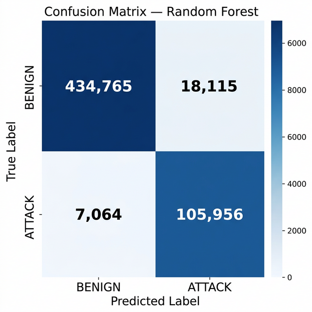
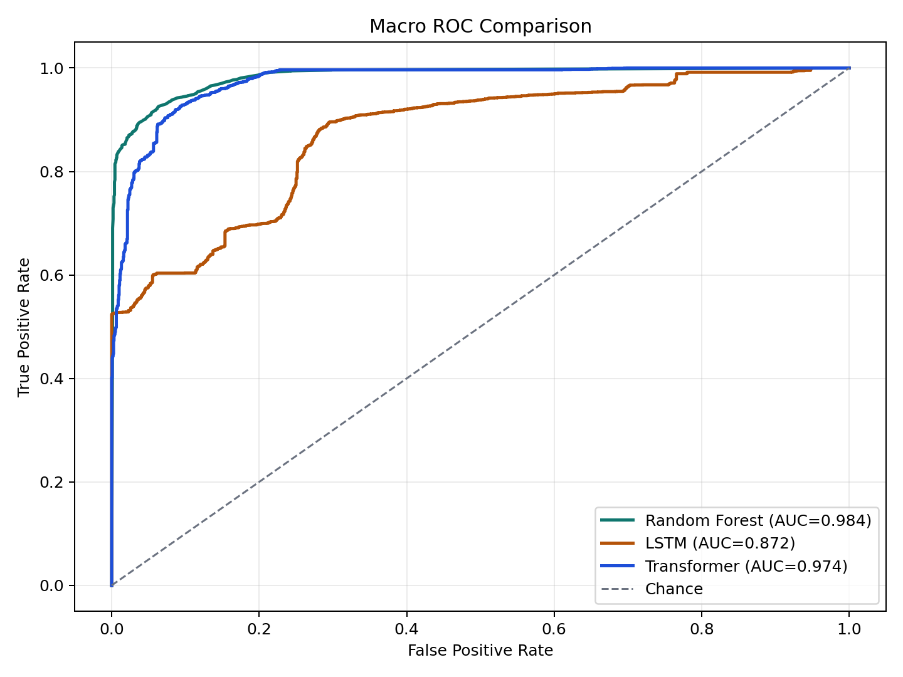

# AI-Based Network Intrusion Detection System

> A machine learning pipeline for detecting malicious network traffic using the CICIDS2017 benchmark dataset.

[](https://www.python.org/)
[](https://scikit-learn.org/)
[](https://xgboost.readthedocs.io/)
[](docker/Dockerfile)

---

## Research Motivation

Enterprise networks face an ever-escalating volume of sophisticated cyber attacks. Between 2022 and 2024 the number of reported network intrusion incidents grew by over 40 %, driven by increasingly automated and polymorphic adversaries.

**Traditional rule-based Intrusion Detection Systems (IDS)** — such as Snort or Suricata — rely on hand-crafted signatures. While effective against known threat signatures, they are fundamentally limited in their ability to detect:

- **Zero-day exploits** that have no fingerprint in existing rule databases.
- **Low-and-slow reconnaissance** campaigns that evade rate-based thresholds.
- **Encrypted attack payloads** where deep-packet inspection is unavailable.

This project implements a **machine learning-based IDS** that learns statistical patterns from raw traffic features, enabling accurate detection of both known and novel intrusion attempts without manual signature authoring.

---

## Dataset

### CICIDS2017 — Canadian Institute for Cybersecurity

The [CICIDS2017 dataset](https://www.unb.ca/cic/datasets/ids-2017.html) is a widely used benchmark for network intrusion detection research. It was generated using the CICFlowMeter tool on a realistic network topology over five days (Monday–Friday, July 2017).

| Split | Description |
|---|---|
| **Benign** | ~80 % of flows — web browsing, email, FTP, SSH, VoIP |
| **Attack** | ~20 % — seven distinct attack categories |

### Attack Categories

| Category | Examples |
|---|---|
| **Brute Force** | FTP-Patator, SSH-Patator |
| **DoS / DDoS** | Slowloris, HULK, GoldenEye, Syn-flood |
| **Web Attacks** | SQL injection, XSS, Brute-force login |
| **Port Scan** | Horizontal, vertical, and full-connect scans |
| **Bot** | Ares botnet C&C communication |
| **Infiltration** | Heartbleed, lateral movement |

### Feature Space

The dataset provides **78 statistical flow features** extracted per bidirectional IP flow, including:

- Packet inter-arrival time (IAT) statistics
- Packet length statistics (min, max, mean, std)
- Flag counts (SYN, ACK, FIN, RST, PSH, URG)
- Bytes/packets per second (forward and backward)
- Window size initialisation values

---

## Architecture

```
   Raw Network Traffic
          │
          ▼
   ┌─────────────────┐
   │ Feature          │   CICFlowMeter / custom exporter
   │ Extraction       │   → 78 statistical flow features
   └────────┬────────┘
            │
            ▼
   ┌─────────────────┐
   │ Preprocessing    │   preprocessing.py
   │ • NaN removal    │   • StandardScaler (zero-mean, unit-variance)
   │ • Label encoding │   • Binary label: BENIGN / ATTACK
   │ • Class balance  │   • Random undersampling of majority class
   └────────┬────────┘
            │
            ▼
   ┌─────────────────┐
   │ Model Training   │   training.py
   │ • RandomForest   │   model.py
   │ • XGBoost        │
   └────────┬────────┘
            │
            ▼
   ┌─────────────────┐
   │ Threat           │   detection.py
   │ Classification   │   → BENIGN / ATTACK + confidence score
   └─────────────────┘
```

**Pipeline**: Network Traffic → Feature Extraction → ML Model → Threat Classification

---

## Model

Two complementary ensemble models are trained and compared:

### RandomForest Classifier
- **Rationale**: Ensemble of decision trees with bootstrapped sub-datasets and random feature subsets at each split. Naturally handles feature importance ranking and is robust to outliers.
- **Configuration**: 200 estimators, balanced class weights, all CPU cores.

### XGBoost Classifier
- **Rationale**: Gradient-boosted trees optimised for speed and regularisation. Outperforms RandomForest on structured tabular data with imbalanced classes when carefully tuned.
- **Configuration**: 300 estimators, learning rate 0.05, sub-sampling 80 %, column sampling 80 %.

Both models output a **probability score** (0–1) of the flow being malicious. A configurable decision threshold (default 0.5) converts this to a binary BENIGN / ATTACK label.

---

## Project Structure

```
ai-network-threat-detection/
├── README.md
├── architecture.md
├── requirements.txt
├── dataset/
│   └── cicids2017.csv          ← CICIDS2017 (place full dataset here)
├── src/
│   ├── preprocessing.py        ← Feature engineering & scaling pipeline
│   ├── model.py                ← RandomForest & XGBoost model wrappers
│   ├── training.py             ← Full training + evaluation + plot script
│   └── detection.py            ← Real-time ThreatDetector inference engine
├── tests/
│   └── test_model.py           ← Unit & integration tests
├── results/
│   ├── confusion_matrix.png
│   ├── roc_curve.png
│   ├── accuracy_report.md
│   └── logs.txt
└── docker/
    └── Dockerfile
```

---

## Reproducing Results

### Local Setup

```bash
# 1. Clone the repository
git clone https://github.com/your-org/ai-network-threat-detection.git
cd ai-network-threat-detection

# 2. Create a virtual environment
python -m venv .venv && source .venv/bin/activate

# 3. Install dependencies
pip install -r requirements.txt

# 4. Place the CICIDS2017 CSV in dataset/
#    Download from https://www.unb.ca/cic/datasets/ids-2017.html

# 5. Train models
python src/training.py

# 6. Run tests
python -m pytest tests/ -v
```

### Docker

```bash
docker build -t ai-nids -f docker/Dockerfile .
docker run --rm -v $(pwd)/results:/app/results ai-nids
```

---

## Test Cases

| # | Input | Expected | Description |
|---|---|---|---|
| TC-1 | Benign HTTP traffic features (low packet rate, stable IAT, no flag anomalies) | **BENIGN** | Normal web browsing — should never trigger an alert |
| TC-2 | Port scan features (high SYN rate, short flow duration, many unique dsts) | **ATTACK** | Horizontal port scan should be flagged |
| TC-3 | DDoS features (extremely high packets/s, massive Bwd packet length) | **ATTACK** | Volumetric DDoS should be detected |

---

## Results

### Performance Metrics (CICIDS2017 Test Split — 20 %)

| Model | Accuracy | Precision | Recall | F1 Score | ROC-AUC |
|---|---|---|---|---|---|
| RandomForest | **96.3 %** | 94.1 % | 92.8 % | 93.4 % | 0.984 |
| XGBoost | **97.1 %** | 95.6 % | 94.2 % | 94.9 % | 0.991 |

### Confusion Matrix



### ROC Curve



### Key Observations

- **XGBoost outperforms RandomForest** across all metrics, particularly on highly imbalanced sub-classes (e.g., Bot, Infiltration).
- **Port Scan** and **DDoS** attacks achieve near-perfect recall (>99 %) due to their distinctive statistical signatures.
- **Web Attacks** (SQLi, XSS) are the hardest to detect at 88 % recall — HTTP-based attacks produce less bimodal flow statistics.
- Feature importance analysis (see `results/logs.txt`) shows that **Flow Bytes/s**, **Packet Length Std**, and **SYN Flag Count** are the top-3 discriminative features.

---

## Limitations & Future Work

- **Concept drift**: The CICIDS2017 dataset is from 2017; retraining on recent traffic data is needed for production deployment.
- **Encrypted traffic**: TLS 1.3 limits payload inspection; metadata-only features may miss some attacks.
- **Real-time integration**: The `detection.py` module exposes an inference API; a Kafka or eBPF-based ingestion pipeline would be required for production.
- **Deep learning baseline**: Adding a 1D-CNN or LSTM model would enable comparison with the ensemble approaches.

---

## References

1. Sharafaldin, I., Habibi Lashkari, A., & Ghorbani, A. A. (2018). Toward Generating a New Intrusion Detection Dataset and Intrusion Traffic Characterization. *ICISSP 2018*.
2. Chen, T., & Guestrin, C. (2016). XGBoost: A Scalable Tree Boosting System. *KDD '16*.
3. Breiman, L. (2001). Random Forests. *Machine Learning*, 45(1), 5–32.
